# Get your To-Do tasks daily in Teams using Power Automate

> This blog post is inspired by Ayca Bas's [excellent blog post](https://dev.to/azure/get-your-to-do-tasks-every-morning-on-microsoft-teams-using-azure-logic-apps-3ci1) on this subject using Azure Logic Apps instead of Power Automate

## Introduction

Microsoft To-Do is a great tool for allowing you to keep lists of tasks across your personal and work life. This could be a something as simple as a shopping list or a project or anything that can be split down into individual tasks.

With the [release of the To-Do APIs in Microsoft Graph](https://docs.microsoft.com/en-gb/graph/todo-concept-overview), it is now possible to integrate with your To-Do tasks outside of To-Do.

## A Helpful Reminder

Whilst you can set reminders against tasks in To-Do, wouldn't it be awesome to have these surface outside of the To-Do app too? Before we start, make sure you have some pending tasks on your **Tasks** list in To-Do!

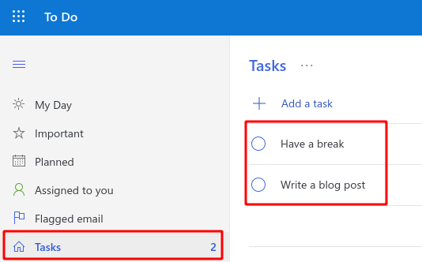

In this article, we will go over how we can have Power Automate send your outstanding tasks daily into Microsoft Teams. To achieve this, we will undertake the following:

* Learn how to interact with the Microsoft Graph To-Do APIs in [Microsoft Graph Explorer](https://developer.microsoft.com/graph/graph-explorer)
* Register an [Azure Active Directory app](https://docs.microsoft.com/azure/active-directory/develop/quickstart-register-app)
* Create a Power Automate Custom Connector to interface with the Microsoft Graph To-Do APIs
* Create a Power Automate Flow to automate sending tasks to Microsoft Teams using the Microsoft Teams Flow Bot

## Microsoft Graph To-Do APIs in Graph Explorer

To understand how the Microsoft Graph To-Do API queries work, let's use [Microsoft Graph Explorer](https://developer.microsoft.com/graph/graph-explorer) to make a query against your own data. The first task is to select **Sign in to Graph Explorer**.

Once signed in, under the **Getting Started** section of **Sample queries** run the **my To Do task lists** query. This should run the query of `https://graph.microsoft.com/v1.0/me/todo/lists` and return your task lists.

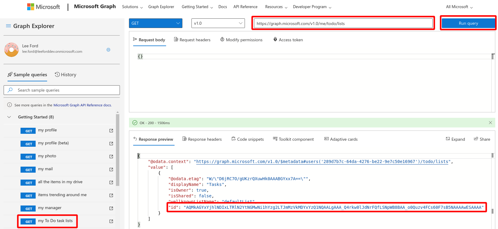

You will notice inside the response there is a task list with an `id`. Using the `id`, change the address of the query to `https://graph.microsoft.com/v1.0/me/todo/lists/{taskListId}/tasks`, with `{taskListId}` being replaced with the `id` in the response.

> If the task lists response contains multiple task lists, don't worry, just choose the list with the name `Tasks`

Based on my response above, my query would be `https://graph.microsoft.com/v1.0/me/todo/lists/AQMkAGYxYjhlNDIxLTRlN2YtNGMwNi1hYzg2LTJmMzVkMDYxYzQ1NQAALgAAA_Q4rkw0lJdNrFQfLSNpWB8BAA_o0Quzv4FCs60F7sB5NAAAAwESAAAA/tasks`

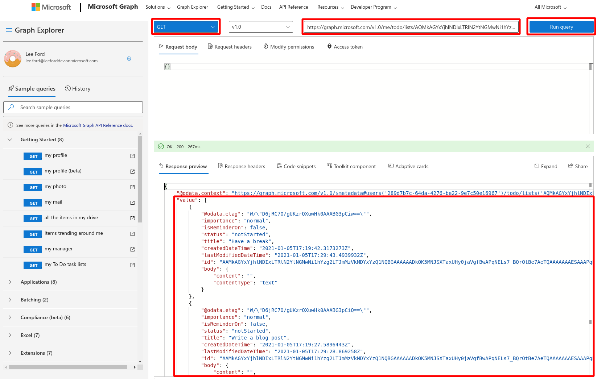

> Ensure you set the request type to `GET` and the version to `v1.0`

Take a copy of your request address as we will need that later on.

## Register an app in Azure Active Directory

To be able to read your To-Do task data using Microsoft Graph, we will need to grant an Azure AD application permission to access it.

> This app registration can be used for more than one user, should you wish for multiple users to use this solution, the same registration can be used for each Power Automate Flow

### Registration

First, go to **Azure Active Directory** in the [Azure Portal](https://portal.azure.com). Under **App registrations** select **New registration** from the top menu.

Give the app an arbitrary **Name** e.g. `To-Do_PowerAutomate`, leave **Supported account types** and **Redirect URI** with the default values. Select **Register** to create the app.

With the app created, take note of the **Application (client) ID** as this will be needed later.

### Create a secret

Next, we need to create a secret under **Certificates and secrets** on the left-hand menu. To create a secret, select **New client secret** and give the secret a **Description** and when it **Expires**.

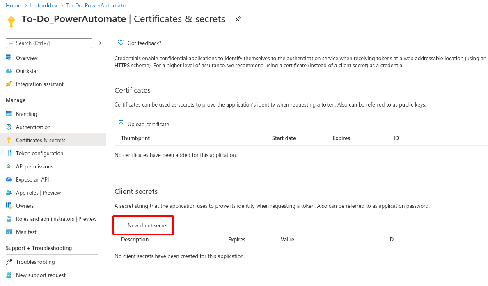

*Before* the next step, take a copy of the **Value** of the secret and store it securely somewhere.

### Assign Microsoft Graph permissions

Finally, we need to assign Microsoft Graph To-Do permissions to our app. This allows our app to query To-Do APIs in Microsoft Graph as we did in Microsoft Graph Explorer earlier.

Under **API permissions** on the left-hand menu, select **Add a permission**.

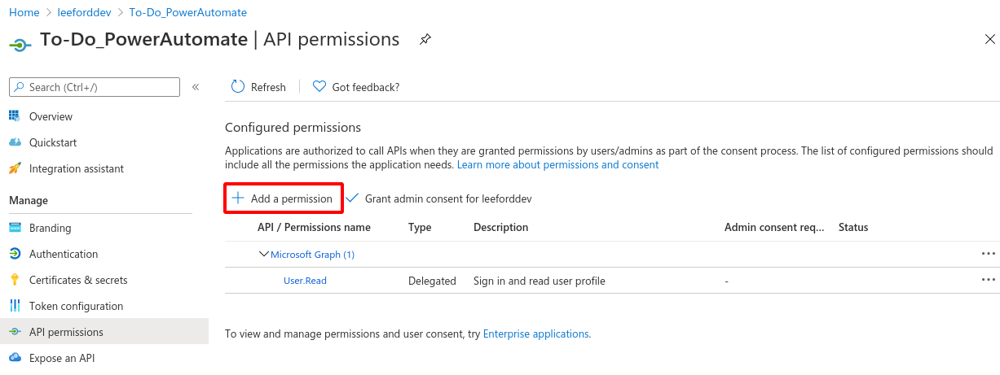

Select **Microsoft Graph** as the **Microsoft API** and **Delegated permissions**. Search for `Tasks` and choose the `Tasks.Read` permission and select **Add permissions**.

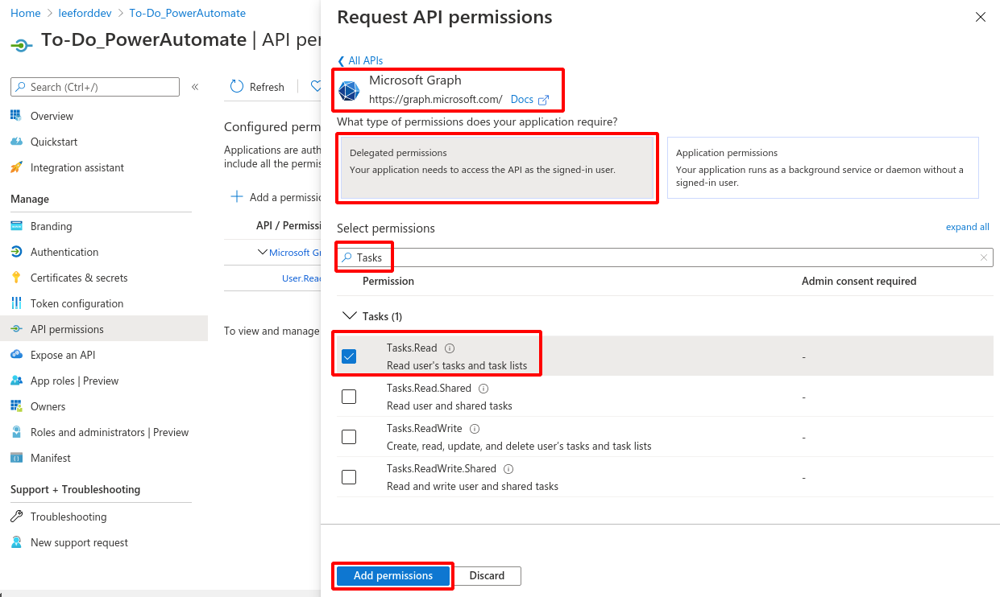

You should now see `Tasks.Read` under **Configured permissions**.

That is all we need to do here for now, but there is one final step to be done, later on, so leave the page open in your browser.

## Create Power Automate Custom Connector
Moving over to [Power Automate](https://flow.microsoft.com), we need to create a Custom Connector. A Custom Connector is a way of interfacing with APIs in specific ways, in our case - talking to Microsoft Graph and obtaining our list of tasks.

To create a Custom Connector, go to **Data > Custom connectors** on the left-hand menu in Power Automate. Here, select **New custom connector** and **Create from blank**

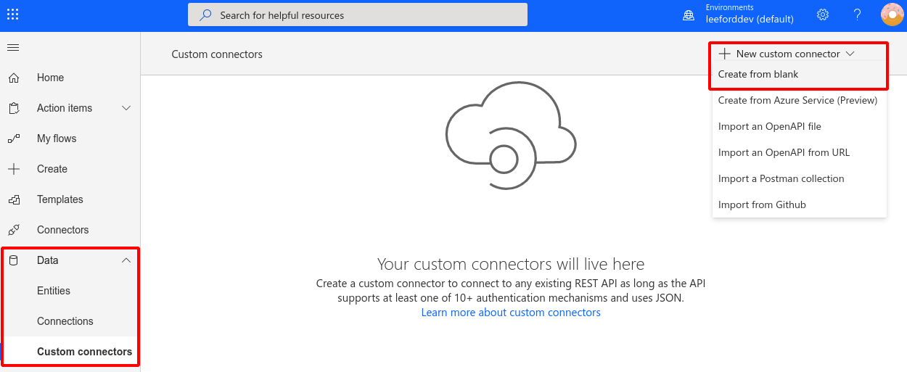

Give your connector an arbitrary **Connector name** e.g. `To-Do_Connector` and choose **Continue**

For the first step, we need to specify the **Host** as `graph.microsoft.com` and select **Security** to move on to the next step.

For security, set as follows:

* **Authentication type**: `OAuth 2.0`
* **Identity Provider**: `Azure Active Directory`
* **Client id**: **Application (client) ID** we noted down when creating the Azure AD app
* **Client secret**: **Client secret** we noted down when creating the Azure AD app
* **Resource URL**: `https://graph.microsoft.com` with no trailing `/`
* Everything else can be left as it is

Select **Definition** to move on to the next step.

We now need to create an **Action**. An **Action** is an operation that our connector will perform when asked. In our case, our connector will retrieve our To-Do tasks for us.

Select **New action** and provide the action with the following:

* **Summary**: A summary of what the action is doing e.g. `Get To-Do tasks`
* **Description**: A more in-depth description on what the action is doing e.g. `Get To-Do tasks for signed-in user`
* **Operation ID**: Unique identifier of the action. Use `GetToDoTasks`
* **Visibility**: `Important`

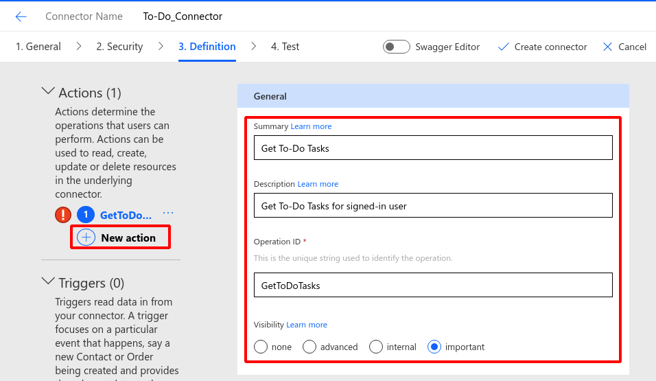

Under the **Request** section, we need to provide it with sample data so the action understands what the data from Microsoft Graph will look like. Choose **Import from sample** and provide the following:

* **Verb**: `GET`
* **URL**: `https://graph.microsoft.com/v1.0/me/todo/lists/{taskListId}/tasks` - you should have a copy of this (with your `taskListId`) from when we used Graph Explorer earlier.
* **Headers**: Leave blank

Select **Import**

Finally, select **Create connector** at the top right. Once saved, go to the **Security** section and copy the **Redirect URI**

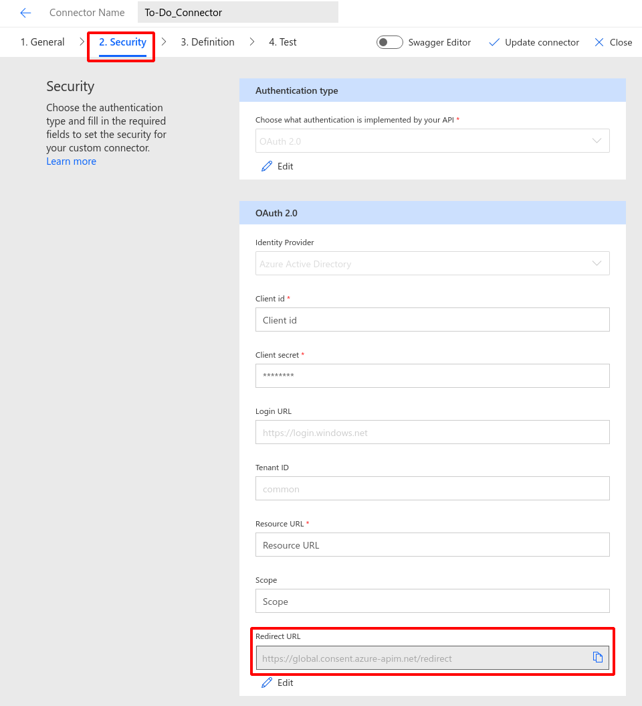

If we now briefly head back to the Azure AD App with the **Redirect URI**. Under **Authentication**, select **Add a platform** and paste the **Redirect URI** you copied into the **Redirect URIs** text box. Select **Configure** to add it.

## Create Power Automate Flow
Now we are going to tie everything together with a Power Automate Flow. A Flow is essentially a *no/low code* way to script something. In our case, we are scripting retrieving our To-Do tasks and sending them in to Microsoft Teams.

To do this, head back the [Power Automate](https://flow.microsoft.com) and select **Create** from the left-hand menu and choose **Scheduled cloud flow**.

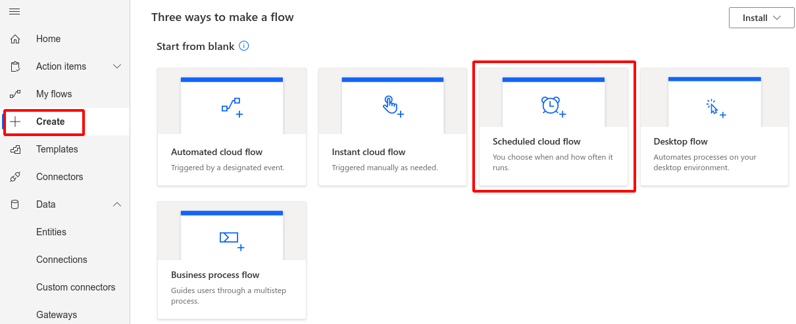

> By sheduling this flow trigger type, it can be scheduled to run as frequently as you like.

Give your flow a **Name** and set a **Repeat every** of `1 Day`. Once done, select **Create**

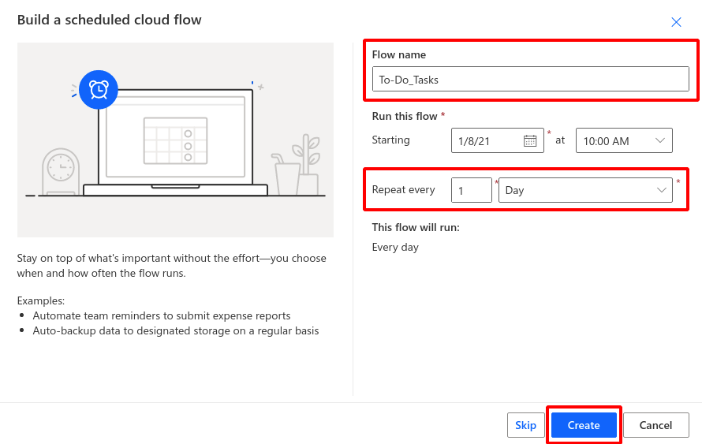

As this is a Flow, the logic will behave as a flow chart would. Under the **Recurrance** trigger, we need to add some additional steps to the Flow.

To start, select **New step** and here we need to find the action we created. The quickest way is to change the type to **Custom** and then select it under **Actions**.

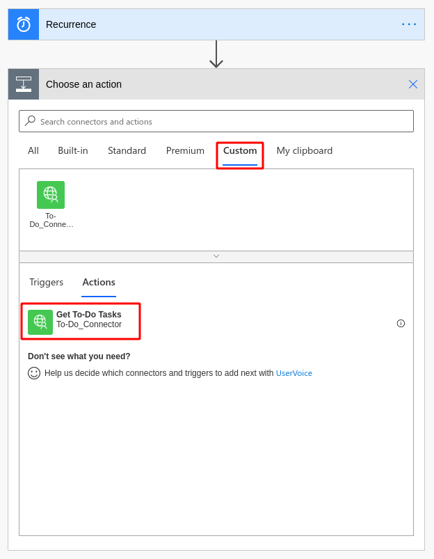

Next, you need to sign in to your account to get your tasks.

> As mentioned earlier, this can be used in multiple flows, allowing a whole team to use the connector to get their own tasks

During the sign-in process, you will need to consent the app to read your task lists.

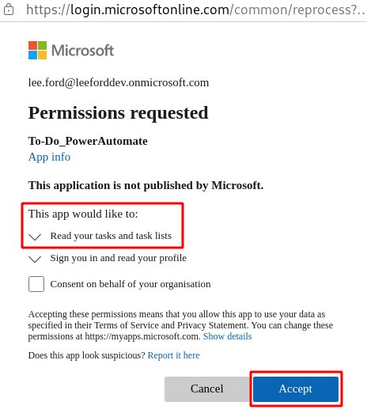

Before we go any further, select **Save** at the top of the page and then go back to **My flows**. Hover over the Flow you created and choose **Run**.

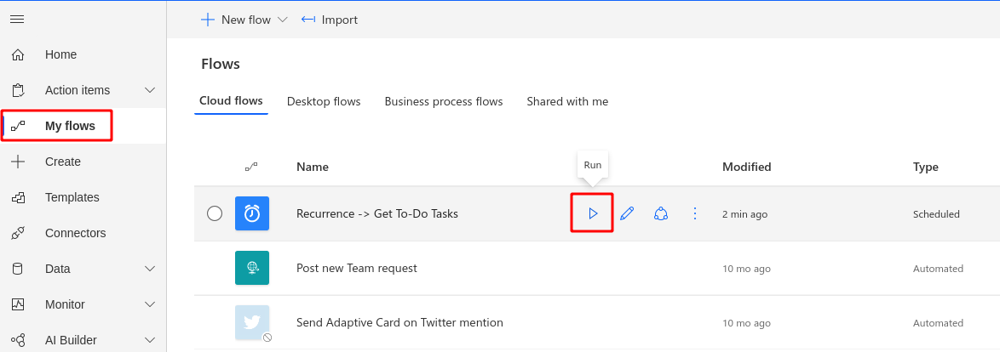

Hopefully, it was successful and you can see the result in the **Flow Runs Page**. 

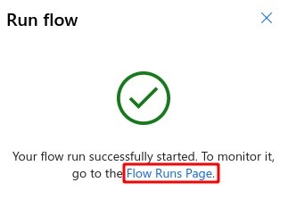

Looking at the **body** of the **Output** there is some data (which is the same as what was shown in Graph Explorer earlier). Copy the **body** output and then select **Edit** at the top of the page to finish off the last bits of the Flow.

The body output is great in JSON format, but we need to be able to split it down in to smaller chunks (tasks). To do this, we need to be able to parse (read) the JSON output. Add a **Parse JSON** step and set the **Content** as `Body`. To create a **Schema** choose **Generate from sample**.

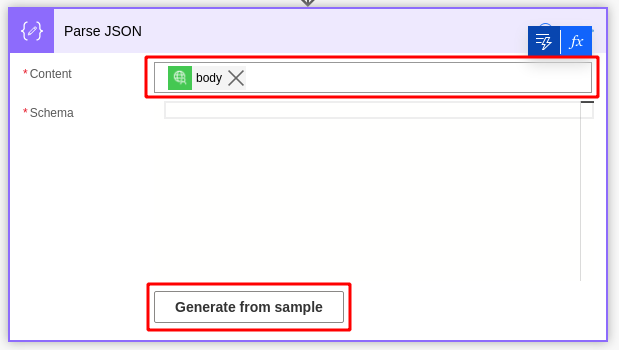

Paste in the body output from earlier and select **Done**.

The next step we need to add is **Initialize variable**. We need to create an Array. An array is a collection of values or objects. In our case, ours is a collection of tasks. Give the variable the name of `Tasks` and set the type to `Array`.

After creating the `Tasks` array, we need to populate it with the tasks. This is achieved by adding an **Apply to each** step. A **Apply to each** is a type of loop. In our case, it will loop through all the tasks in our body JSON we parsed earlier and pick out the values for each task. Start by adding an **Apply to each** loop and selecting `value` output from **Parse JSON**

Next, within the **Apply to each** step, **Add an action** and choose **Compose**. This will take a specific value from the task. Under inputs, choose `title` under **Parse JSON**.

The next step we need to add in the loop is an **Append to array variable**. We will use this to add the task `title` to the `Tasks` array we created earlier. Set the **Value** to the `Outputs` of **Compose**.

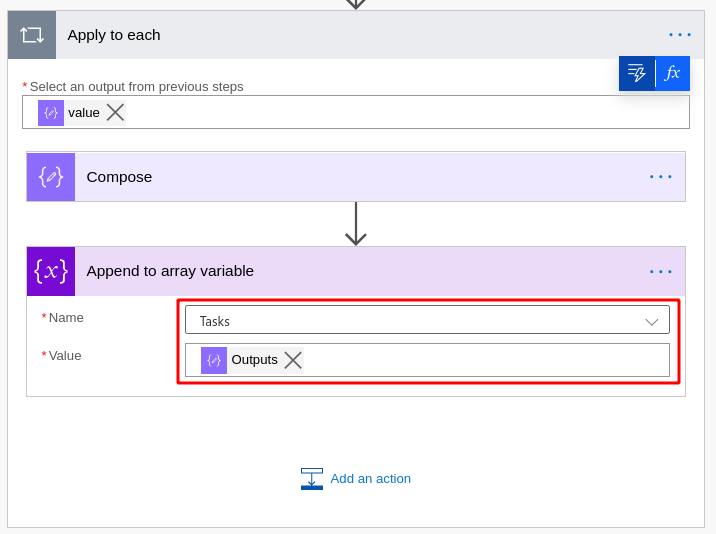

Now we should have a list of tasks ready to use. The next step is to send these to us in Teams. To do this, we need to add **Post a choice of options as the Flow bot to a user**, making sure this is added after the **Apply to each** and not inside it.

Before entering any details, change the options type to an array by clicking the `T` icon.

Now, add the following:

* **Options**: `Tasks` variable
* **Recipient**: The same account you signed in to the Flow with
* **Message**: Something like `Hey, here are your outstanding tasks for today`
* **Headline**: Something like `Your tasks for the day`
* **IsAlert**: `Yes` - This makes it so you are notified of the message in Teams

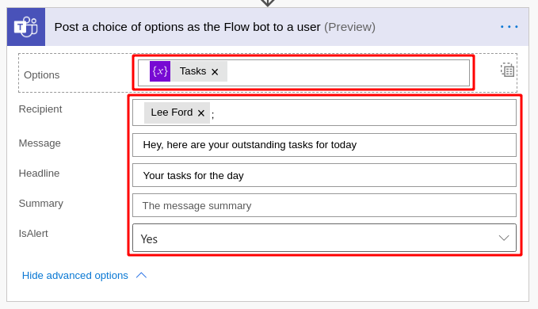

If you were to run the Flow now, you will see the list of tasks appear in Teams. However, choosing any of the tasks doesn't do anything.

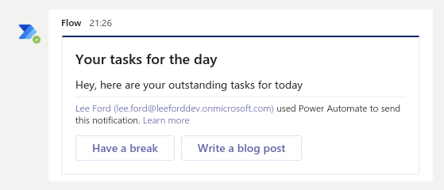

Back in the Flow, we need to fix it so when an option (task) is chosen, we do something with it. Add another **Apply to each** and like the previous loop, select `value` output from **Parse JSON**.

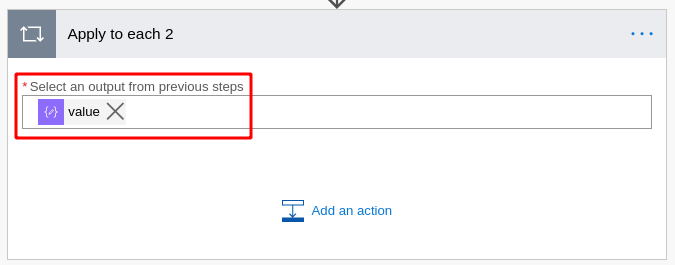

Within this **Apply to each** step, **Add an action** and choose **Condition**. A **Condition** is a way to verifying a value is what we want/don't want. In our scenario, we are looping through tasks and looking for the one that matches what the user selected in Teams. To do this set the first value as `selectedOption` under **Post a choice...** and the second value is `title` under **Parse JSON**.

We now need to act upon when the condition is met (the task equals the chosen option in Teams). Under **If yes**, add **Post message as the Flow bot to a user**. Complete it as follows:

* **Recipient**: The same account you signed in to the Flow with
* **Message**: A message containing the details of the task (see image)
* **Headline**: `Title` from **Parse JSON**
* **IsAlert**: `Yes` - This makes it so you are notified of the message in Teams

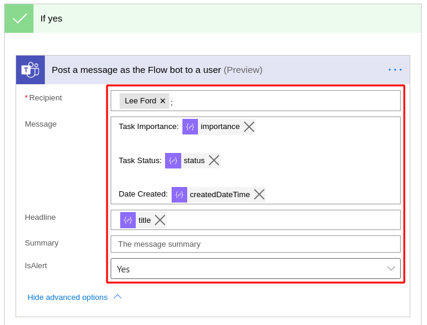

Leave **If no** blank.

## Finishing up

If you now run the Flow it should send you a message with your tasks.

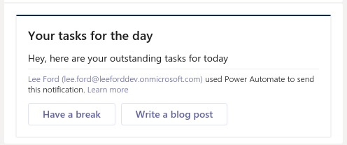

Choosing a task will then return details on that task.

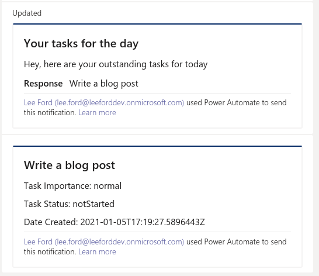

Congratulations, you have now managed create an Azure AD application, talk to Microsoft Graph, pass that in to Power Automate and on to Teams!
